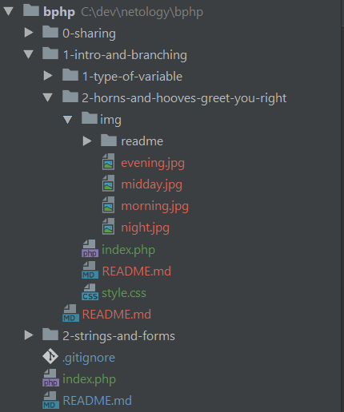

# Общие рекомендации по выполнению домашних работ для слушателей.

## Структура проекта.

Прежде всего - для выполнения домашних работ рекомендуется сделать форк этого проекта, впоследствии вносить изменения в форке.

Все домашние задания и указания по их выполнению находятся в одном проекте.

Для начала работы с домашними заданиями клонируйте репозиторий с домашними заданиями.

Чтобы не происходило путанницы, задания следует разделять:
- верхний уровень - номер и наименование занятия.
- второй уровень - номер задания.

Внутри папки с заданием находится файл `README.md` с указанием к выполнению работы.

Вместе с ним могут быть изображения в папке `img/readme`.

Основной файл домашнего задания всегда именуется как index.php.

Все остальные файлы, относящиеся к этому заданию, находятся в папке задания или вложенных в неё папках

Все файлы задания находятся в его папке.

Пример структуры:



---

## Оглавление.
В корне проекта находится файл index.php примерно с таким содержанием:
```php=
<!DOCTYPE html>
<html lang="en">
<head>
    <meta charset="UTF-8">
    <title>bPHP</title>
</head>
<body>
<ul>
    <li>Блок 1. Базовый синтаксис. PHP в HTML и HTML средствами PHP
        <ul>
            <li>Занятие 1.1. Знакомство с PHP
                <ul>
                    <li><a href="1.1-intro-and-branching/1.1.1">Задание 1.1.1</a></li>
                    <li><a href="1.1-intro-and-branching/1.1.2">Задание 1.1.2</a></li>
                </ul>
            </li>
        </ul>
    </li>
</ul>
</body>
</html>
```

Этот файл служит оглавлением для всего проекта, упрощая навигацию при просмотре и проверке.

Изначально в этом файле есть ссылки на папки заданий по первой лекции.

При появлении новых решений этот файл дополняется слушателем.

Оглавление на странице выглядит так:


Допускается оформление этой страницы (стили, изображения, js). 

В этом случае все необходимые ресурсные файлы располагаются в корне проекта и в папках, 
созданных слушателем из корня.

---

## Code style
Работы должны соответствовать принятому [стилю оформления кода](https://github.com/netology-code/codestyle).
Обратите внимание, что это относится не только к коду на PHP.

---

## Hosting
Все домашние работы должны быть размещены на хостинге.
[Инструкция](hosting)

---

## GIT
Репозиторий git должен содержать актуальную версию программного кода.

---

## Что отправлять на проверку?
В сообщении к тренеру на проверку работы вкладывается:
* ссылки на страницы решений на хостинге;
* ссылка на репозиторий git.

---

## Рекомендации при сдаче работы. 

Ожидание проверки, проверка работы, написание замечаний и рекомендаций занимает определенное время.

Чтобы эффективно использовать время - своё и тренеров, перед тем, как сдать работу:
1. Ещё раз прочитайте текст задания. Удостоверьтесь, что задание понято верно.
2. Проверьте, что учтены все требования условия задания.
3. Проверьте, что программный код соответствует требованиям к оформлению.
4. Проверьте, что все файлы в репозитории обновлены.
5. Проверьте, что репозиторий приватный и открыт доступ для преподавателя, проверяющего работу.

Узнать имя проверяющего вы сможете в личном кабинете при сдаче домашней работы. 

Аккаунты преподавателей:
Алексей Кулагин @alQlagin, Андрей Борю @andrey-borue, Сергей Вертепов @SkYler163, Алексей Дацков @smap, Алексей Судничников @avsudnichnikov, Алексей Копылов @Teplophizik.

Как добавить доступ преподавателю: [скриншот](https://yadi.sk/i/B_79e8kBGglb4A)

6. Проверьте, что файлы, относящиеся к заданию, обновлены на хостинге. 
7. Проверьте, что на хостинге ссылки кликаются, сам сайт работает, неожиданно не падает.
8. Проверьте корректность решения.
