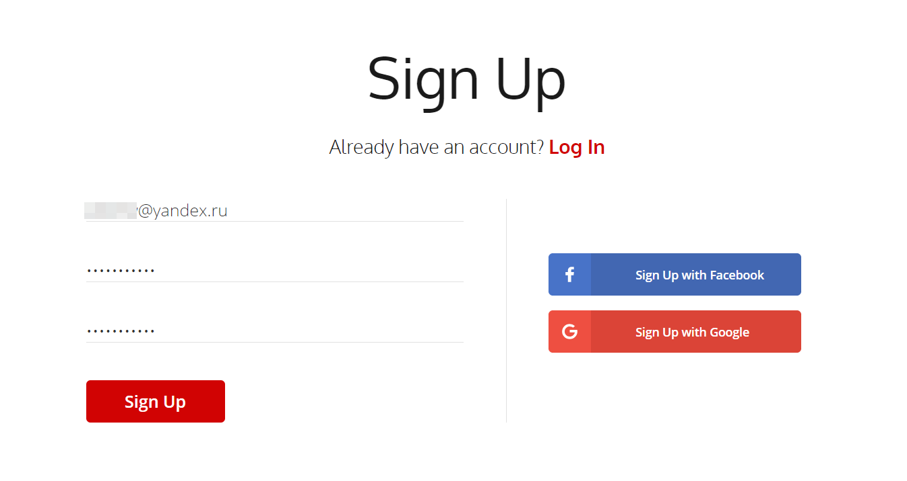
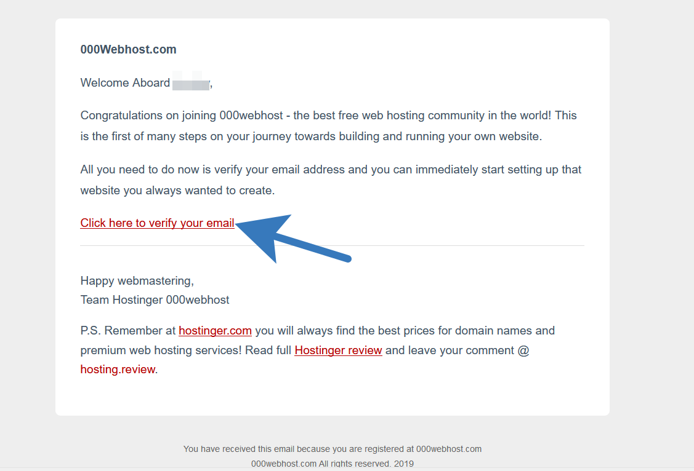
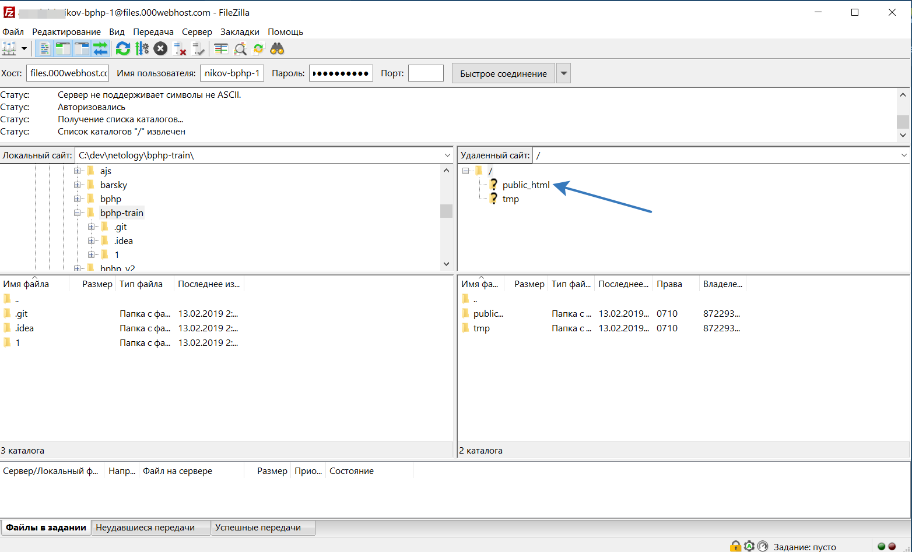

# Размещение сайта на хостинге.

---

## Слушатель имеет право выбрать любой удобный для него хостинг, домен или ftp-клиент.

---

## В инструкции предлагается вариант с бесплатным хостингом и доменом от [000webhost.com](https://www.000webhost.com) и ftp-клиентом [FileZilla](https://filezilla-project.org).

Примечание: Внимание! при работе с хостингом обнаружены следующие проблемы:
- отсутствует поддержка "коротких тегов" (`<?...?>`, `<=...=>`)

---

## Зайдите на хостинг [https://www.000webhost.com](https://www.000webhost.com) и зарегистрируйтесь.

---

---

*Подтверждение электронного адреса*

---

## Создайте свой сайт

---

---

## Запомните (сохраните) этот пароль, он потребуется для подключения по FTP

---

## Откройте настройки

---

---

## Слева (1) вы можете видеть адрес Вашего сайта, справа (2) - настройки для подключения по FTP

---

## Зайдите на официальный сайт проекта FileZilla ([https://filezilla-project.org](https://filezilla-project.org)) и скачайте дистрибутив.

---

## Установите и откройте FileZilla

---

## Введите имя хоста, имя пользователя и пароль (1) и нажмите кнопку "Быстрое соединение" (2)

---

## Выберите папку public_html. Не изменяйте файл `.htaccess`

---

## Перенесите файлы на удаленный сайт в папку public_html, сохраняя структуру проекта.   Не нужно переносить папки git и папки, создаваемые средой разработки

---

## Перейдите по ссылке (1) на Ваш сайт

---

## Проект с одним выполненным заданием выглядит так:

---

---

# Дополнительная информация

[Что такое хостинг?](https://ru.wikipedia.org/wiki/Хостинг)

[Что такое домен/доменное имя?](https://ru.wikipedia.org/wiki/Доменное_имя)

[Что такое FTP?](https://ru.wikipedia.org/wiki/FTP)
