# Задание 0 - Hello, World!

## Общие положения:
1. Во всех инструкциях приведены примеры работы с определенным программным обеспечением и хостингом. 
Для другого программного обеспечения и хостинга инструкции нами приведены не будут, однако, это не значит, что Вы не можете ими пользоваться.
2. Эта домашняя работа служит для пояснения, как работать с php, git, vscode, MAMP без каких-либо пояснений. 
Предполагается, что она выполняется теми, кто не знает совершенно как работать и что делать.
3. В инструкции приняты некоторые допущения:
   - на компьютере установлена операционная система семейства Windows (наиболее распространена среди новичков);
   - проект будет располагаться на компьютере в директории `c:/dev/netology/bphp/homeworks`.

## Задание

Обязательная часть - Вывести на странице сообщение `Hello, World!` c помощью команды `echo`.

Необязательная часть - Вывести на странице сообщение `Hello, World!` c помощью команды `echo`. Сообщение должно находиться в центре, на странице должно быть фоновое изображение.

## Алгоритм выполнения.

### 1. Установка программного обепечения
1. Для выполнения домашних заданий подойдёт любой редактор кода, однако все примеры рассматриваются на примере [VS Code](https://code.visualstudio.com). Если он у Вас не установлен, перейдите по [ссылке](https://code.visualstudio.com), скачайте и установите его.  
2. Для работы с удалёнными (от слова "дальний") репозиториями Вам потребуется [GIT](https://git-scm.com). Если он у Вас не установлен, перейдите по [ссылке](https://git-scm.com), скачайте и установите его.
3. Для выполнения php-скриптов на вашем компьютере Вам потребуется локальный веб-сервер. Если вы самостоятельно не можете установить или настроить веб-сервер, ниже рассмотрен пример настройки пакета [MAMP](https://www.mamp.info/en/). Для его работы Вам потребуется установить его.

### 2. Регистрация на GitHub. Создание репозитория
1. Если Вы еще не зарегестрированы на [https://github.com](https://github.com), зарегистрируйтесь
2. Если Вы не авторизованы на [https://github.com](https://github.com), авторизуйтесь.
3. Пройдите по ссылке: [https://github.com/netology-code/bphp-homeworks](https://github.com/netology-code/bphp-homeworks)
4. Создайте форк репозитория в свой профиль
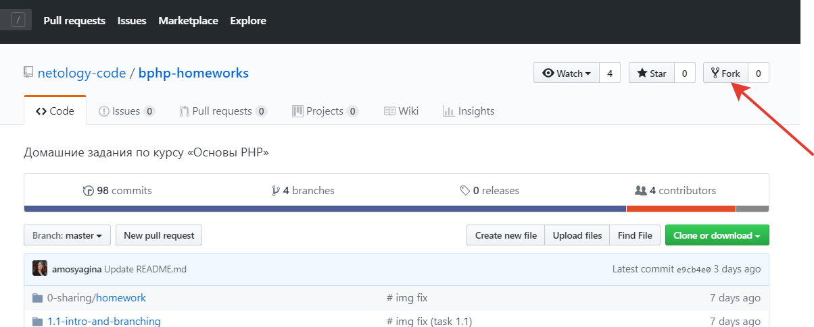
5. Скопируйте ссылку на форк репозитория
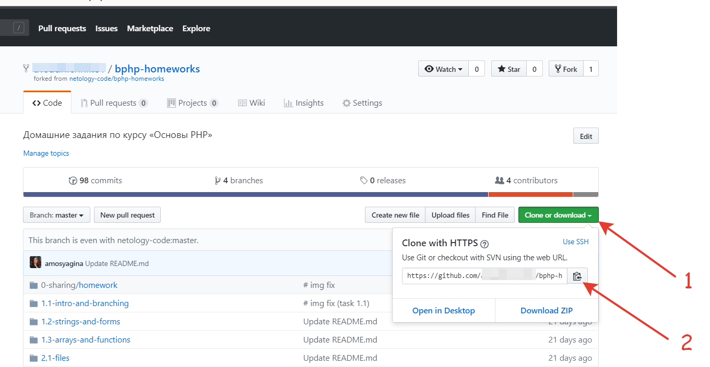
6. Запустите git bash
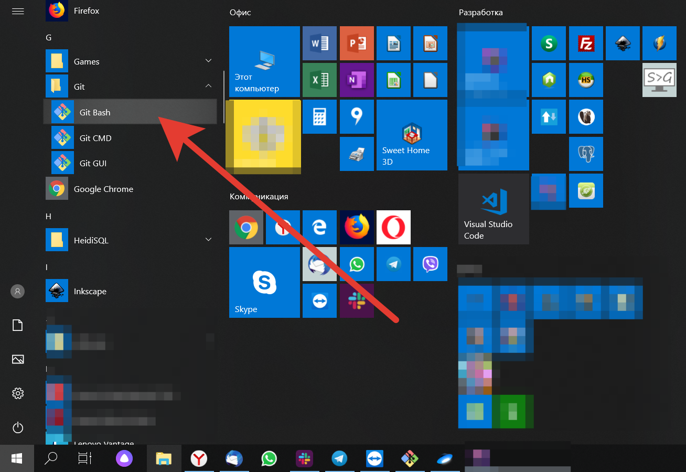
7. Выполните команду:
`git clone <скопированная ссылка> c:/dev/netology/bphp/homeworks`
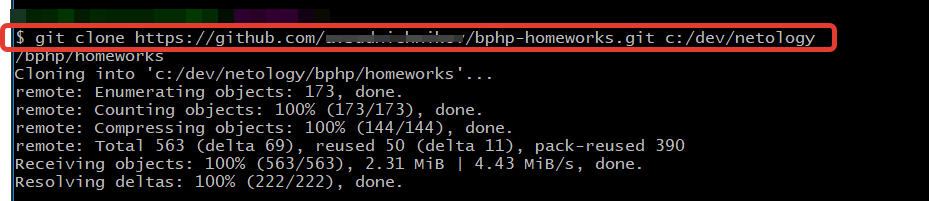

### 4. Настройка локального сервера

Существует несколько [LAMP](https://ru.wikipedia.org/wiki/LAMP)

Рассмотрим настройку на примере [MAMP](https://www.mamp.info/en/)

Предположим, у Вас на компьютере установлен пакет MAMP.

1. Откройте программу настройки и запуска сервера:
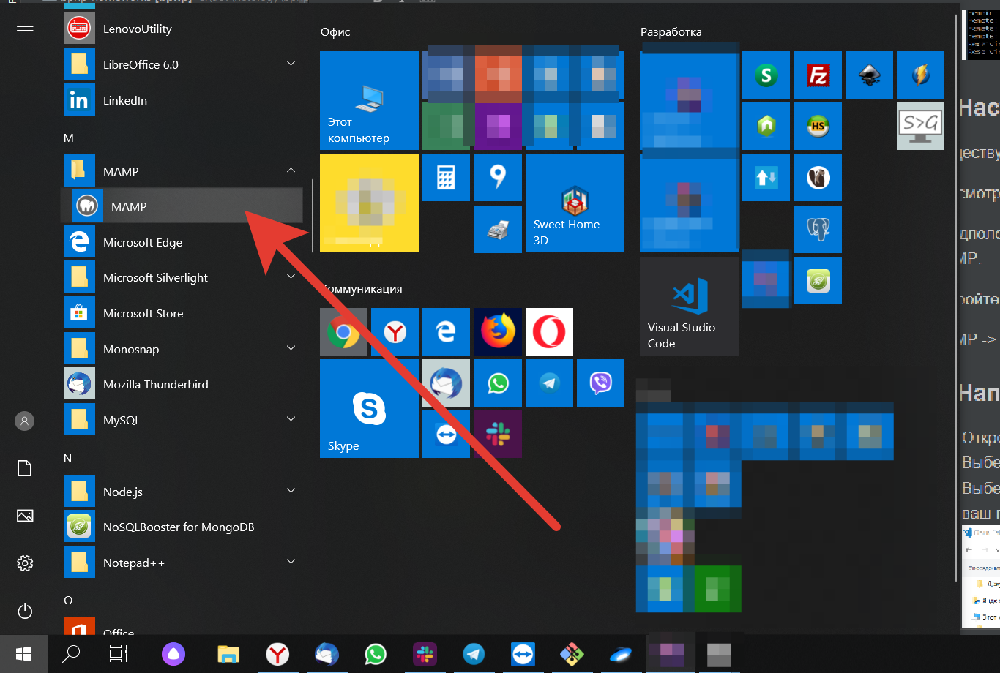
2. Если сервер включен (надпись `Stop servers`), отключите:
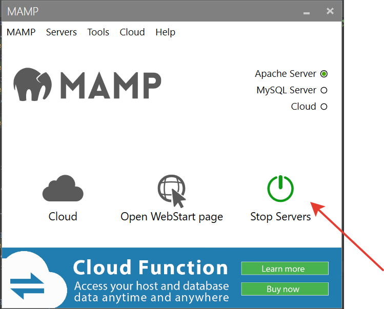
3. Перейдите `MAMP -> Preference`
4. На вкладке `Web Servers` измените `Document root` - выберите `c:/dev/netology/bphp/homeworks`:
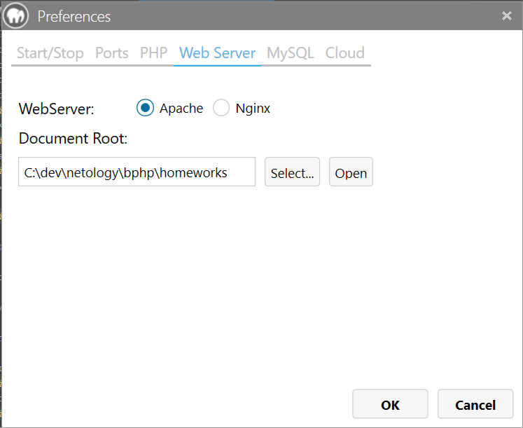
   и нажмите "ОК"
5. Нажмите "Start servers"
6. Нажмите "Open Webstart Page"
7. В адресе открывшейся страницы удалите текст `/MAMP/`
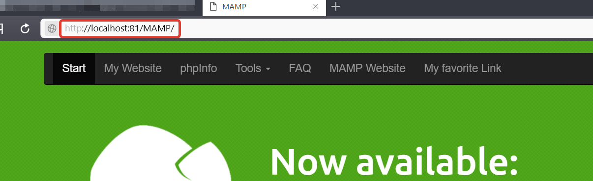
8. И перейдите на страницу по получившемуся адресу:
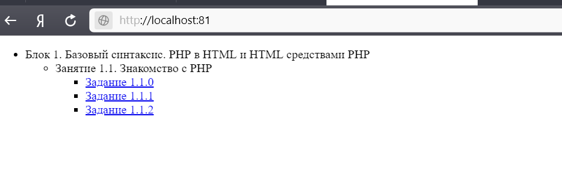
9. Не закрывайте браузер.

### 5. Написание кода. Часть 1
1. Откройте VSCode
2. Выберите: `File`->`Open Folder`
3. Выберите директорию (папку), в которой хранится ваш проект
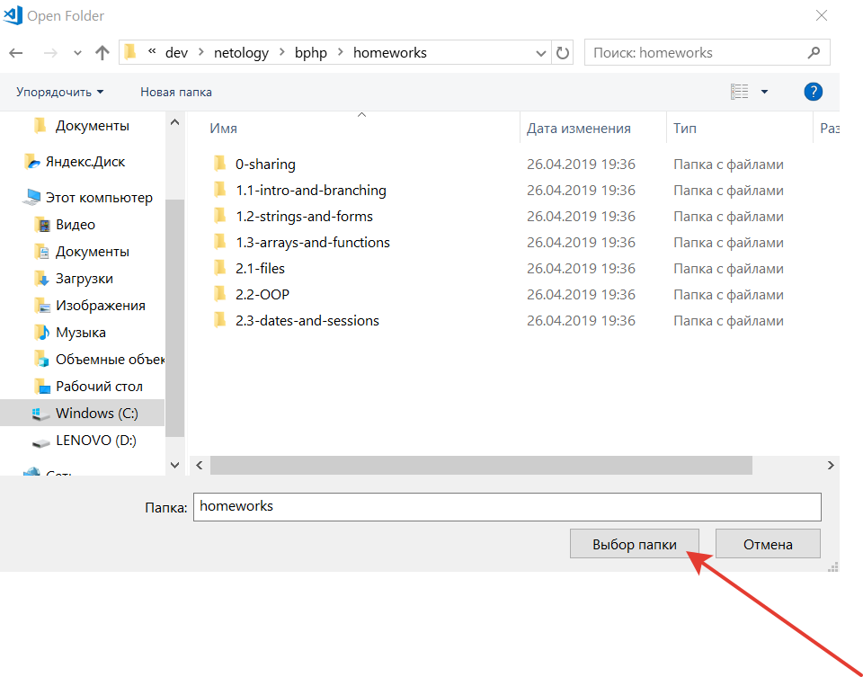

4. Создайте файл `index.php` в директории `1.1-intro-and-branching/1.1.0`
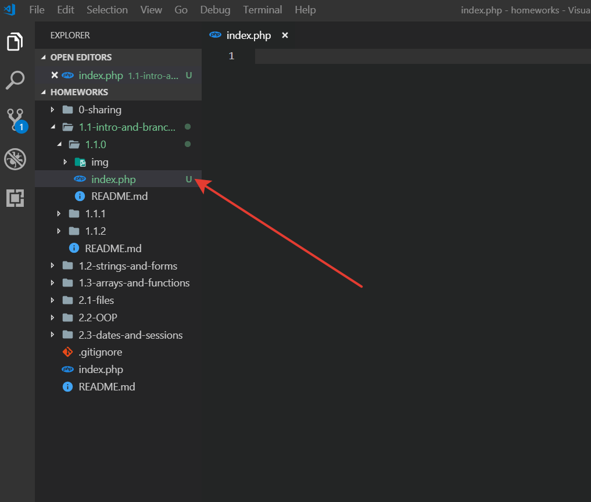
5. Напишите в этом файле `<?php echo 'Hello, World!';`
6. Сохраните изменения
7. Вернитесь в браузер
8. Выберите пункт меню `Задание 1.1.0`
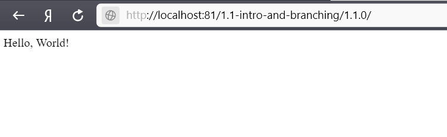


### 6. Написание кода. Часть 2
1. Перейдите по [ссылке](https://pixabay.com/ru/photos/компьютер-компьютерный-код-экран-1209641/)
2. Скачайте изображение
3. Скопируйте файл с изображением в директорию `1.1-intro-and-branching/1.1.0/img`. 
Переименуйте файл с изображением в `1.jpg`;
4. Создайте файл `style.css` в директории `1.1-intro-and-branching/1.1.0`
5. В файле `style.css` напишите следующий код, после чего сохраните:
```css
body,html{
    margin: 0;
    padding: 0;
}

html{
    height: 0;
}

.img {
    width: 100%;
    height: 100vh;
    display: flex;
    justify-content: center;
    align-items: center;
    background-size: cover;
    background-position-x: center;
    background-position-y: center;
}

.greeting{
    background: rgba(255, 255, 255, 0.5);
    padding: 12px 24px;
    border-radius: 6px;
    text-align: center;
}

h1, h2 {
    margin: 0;
    padding: 12px;
}

h1 + h2 {
    border-top: 1px solid;
}
```
6. В файле `index.php` удалите написанное и напишите следующий код, после чего сохраните:
```php
<?php 
$text = 'Hello, world!';
$image = 'img/1.jpg';
?>

<!DOCTYPE html>
<html lang="en">
<head>
    <meta charset="UTF-8">
    <title>bPHP - 1.1.0</title>
    <link rel="stylesheet" type="text/css" href="style.css">
</head>
<body>
    <div class="img" style="background-image: url(<?= $image; ?>)">
        <div class="greeting">
            <h1><?= $text; ?></h1>
        </div>
    </div>
</body>
</html>
```
7. Обновите страницу в браузере:
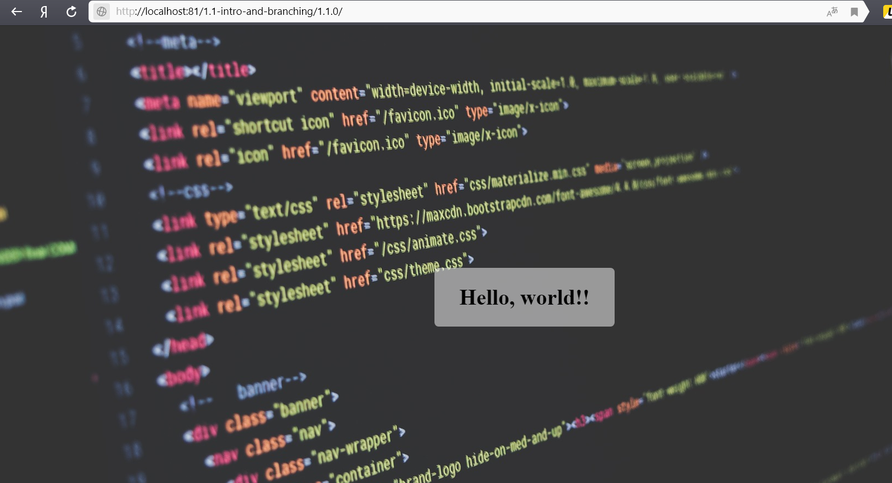

### 7. Подготовка работы к сдаче
1. Для того, чтобы передать изменения в удаленный репозиторий, откройте git bash и выполните команды:
   - `cd c:/dev/netology/bphp/homeworks`
   - `git add .`
   - `git commit -m 'task 1.1.0 done'`
   - `git push`
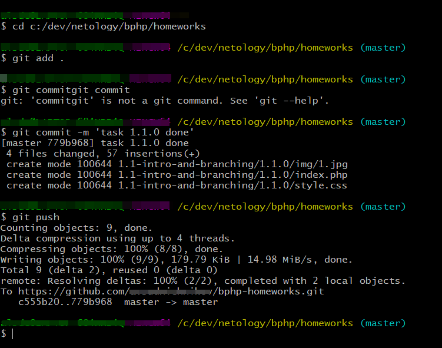
2. Разместите файлы задания на хостинг в соответствии с [инструкцией](../../0-sharing/homework/hosting).

### 8. Сдача работы
1. Отправьте проверяющему в сообщении ссылку на репозиторий
2. Отправьте проверяющему в сообщении ссылку на хостинге

### 9. Внесение изменений
1. Перед внесением изменений в код обновите код на локальной машине с репозитория нетологии:
   - `cd c:/dev/netology/bphp/homeworks`
   - `git remote add origin https://github.com/netology-code/bphp-homeworks`
2. После внесения изменений в программный код не забудьте выполнить пункты 7 и 8
