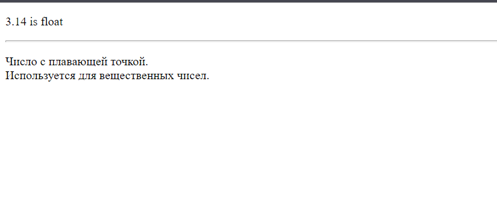

# Задание 1 - Определение типа переменной

## Легенда:
Нередко требуется проверить тип переменной.

Для этого есть определенные функции.
Например, для проверки, является ли переменная булевой, используется функция `is_bool`.
```php=
<?php
$booleanVar = false;

if (is_bool($booleanVar)) {
    echo "bool";
} else {
    echo "not bool";
};

// -> bool
```

## Техническое задание
Напишите алгоритм, который определяет тип переменной используя функции [`is_bool`](https://secure.php.net/manual/ru/function.is-bool.php),  [`is_float`](https://secure.php.net/manual/ru/function.is-float.php), [`is_int`](https://secure.php.net/manual/ru/function.is-int.php), [`is_string`](https://secure.php.net/manual/ru/function.is-string.php), [`is_null`](https://secure.php.net/manual/ru/function.is-null.php).

## Пример входных и выходных данных:
_Input:_ `$variable`, принимающая различные значения, например: `1`,`'one'`, `true`, `3.14`, `null`.
_Output:_ Программный код должен выводить одно из следующих значений:
* для переменных типа bool алгоритм должен сообщать _bool_.
* для переменных типа float алгоритм должен сообщать _float_.
* для переменных типа int алгоритм должен сообщать _int_.
* для переменных типа string алгоритм должен сообщать _string_.
* для переменных типа null алгоритм должен сообщать _null_.
* для переменных типов Array, Object, Resource, алгоритм должен сообщать _other_

Для тестирования _other_ можно использовать следующее значение переменной: `[]`

## Рекомендации по выполнению
Используйте `if..elseif` для ветвления алгоритма.
Пример выполнения:
```php=
<?php
$variable = 3.14;
//  Ваш программный код, в котором переменной $type
//  присваивается одно из значений: bool, float, 
//  int, string, null или other
?>

<!DOCTYPE html>
<html lang="en">
<head>
    <meta charset="UTF-8">
    <title>bPHP - 1.1.1</title>
</head>
<body>
    <p><?=$type?></p>
</body>
</html>
```

## Дополнительно, по желанию
Выводите не только тип, но и описание типа переменной.



**Обратите внимание на** [**рекомендации по сдаче домашнего задания**](https://github.com/netology-code/bphp-homeworks/blob/master/0-sharing/homework/README.md).
