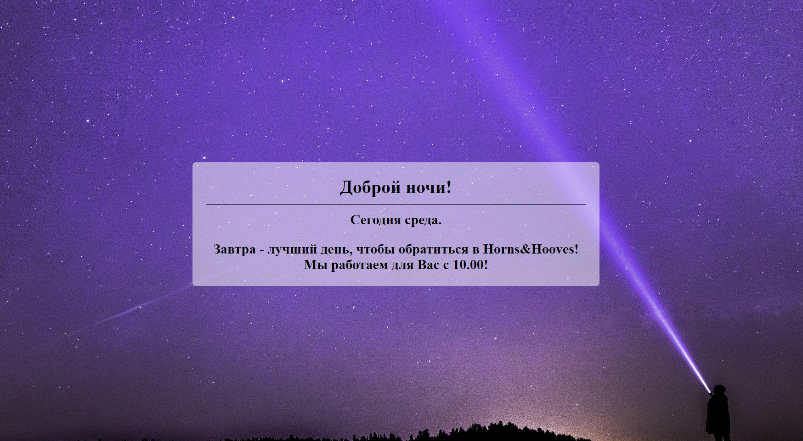

# Задание 2 - Horns&Hooves приветствует Вас правильно!

## Легенда.
Системные аналитики компании "Horns&Hooves" выяснили, что если пользователя правильно приветствовать, повышается уровень продаж на 2,5%. В связи с этим, перед Вами поставлена задача на реализацию страницы приветствия.

## Техническое задание
На основании текущей даты и времени выводить пользователю страницу следующего содержания:
>Доброе утро!
Сегодня - суббота.

Текст приветствия зависит от текущего времени:
- *Доброе утро!* - с 06.00 до 10.59
- *Добрый день!* - с 11.00 до 17.59
- *Добрый вечер!* - с 18.00 до 22.59
- *Доброй ночи!* - с 00.00 до 5.59 и с 23.00 до 23.59

и текущего дня недели.

Текст приветствия выводится крупным текстом посередине страницы.

Фон - соответствующее времени суток изображение.

В рамках задачи нужно пренебречь разницей серверного и клиентского времени.

## Рекомендации по выполнению
Изображения могут быть любыми, соответствующие тематике.
Бесплатные изображения - [https://pixabay.com](https://pixabay.com)

Для получения количества полных часов на текущий момент используйте функцию:
```php=
date("H");
```
Например, для 13.45 - 13.

Для получения порядкового номера текущего дня недели используйте функцию:
```php=
date("N"); 
```
Например, для понедельника - 1.

Пример выполнения:
```php=
<?php
//  Ваш программный код, в котором определяются значения 
//  переменных для последующего задания текста и стилей
?>

<!DOCTYPE html>
<html lang="en">
<head>
    <meta charset="UTF-8">
    <title>bPHP - 1.1.1</title>
    <!-- подключение стилевого файла -->
</head>
<body>
    <!-- Ваша html-вёрстка, частично задаваемая с помощью PHP -->
</body>
</html>
```

*Подсказка: если использовать inline-стили (параметр style) или задание разных классов для блока, можно установить фоновое изображение блока, зависящее от значения переменной*

## Пример входных и выходных данных:
_Input:_ Нет.

_Output:_ Веб-страница, с приветствием и изображением, соответствующими времени суток, а также с правильным отображением дня недели.


## Дополнительно, по желанию
Выводить еще одно сообщение.

1 - Если страница загружается в рабочее время:
> Это лучший день, чтобы обратиться в Horns&Hooves!
> Мы работаем для Вас до ... 

2 - Если страница загружается в нерабочее время:
> Сегодня (или "Завтра" или "Послезавтра") - лучший день, чтобы обратиться в Horns&Hooves!
Мы работаем для Вас с ... 

Предполагается, что Horns&Hooves работает по следующему графику:
* Понедельник 09.00 - 18.00
* Вторник 09.00 - 18.00
* Среда 09.00 - 18.00
* Четверг 10.00 - 18.00
* Пятница 10.00 - 18.00
* Суббота 10.00 - 18.00
* Воскресенье - выходной.



**Обратите внимание на** [**рекомендации по сдаче домашнего задания**](https://github.com/netology-code/bphp-homeworks/blob/master/0-sharing/homework/README.md).
